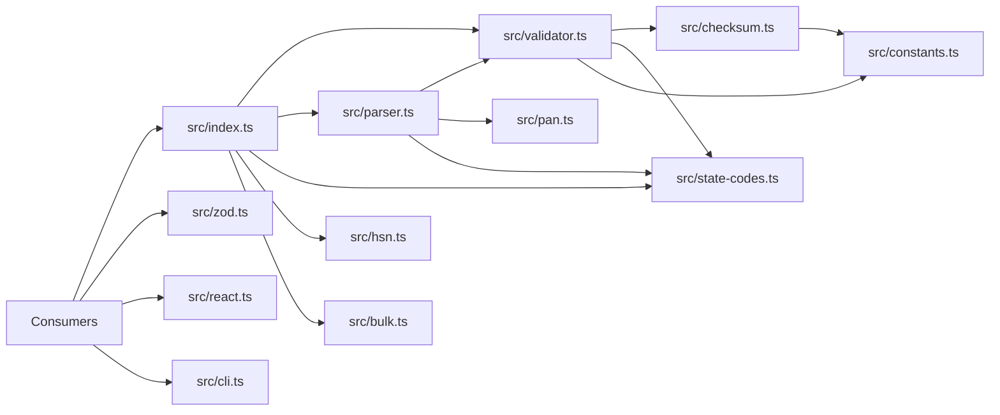

# gstin-toolkit

> A TypeScript-first, dependency-free npm library for GSTIN validation, parsing, decoding, and lightweight adapters.

[](https://www.npmjs.com/package/gstin-toolkit)
[](./LICENSE)
[](./src/types.ts)

## Project Overview

`gstin-toolkit` is a small offline validation library for Indian GSTINs. It exists because GSTIN handling in JavaScript and TypeScript is often either incomplete, stale, or unmaintained. The package covers the core data that applications need locally: format validation, state-code lookup, checksum verification, structural parsing, and a few optional adapters for broader workflows.

The target audience is developers building invoicing tools, billing systems, vendor onboarding forms, accounting software, e-commerce checkout flows, and bulk data cleanup scripts. The design philosophy is intentionally conservative: keep the core package small, keep behavior deterministic, avoid hidden side effects, and make the source easy to read and extend.

Non-goals:

- No online lookup for whether a GSTIN is currently registered.
- No database, monorepo, or service architecture.
- No support for guessing non-standard GSTIN formats beyond the documented rules in this repository.
- No runtime dependency chain in the core package.

## Features

### Core Features

| Feature | Export | Notes |
|---|---|---|
| Boolean GSTIN validation | `isValidGSTIN` | Returns `true` or `false`, never throws for invalid input. |
| Detailed validation result | `validateGSTIN` | Returns all applicable error codes in one pass. |
| GSTIN parsing | `parseGSTIN` | Returns a decoded object or `null`. |
| State lookup | `getStateByCode`, `getCodeByState` | Uses the bundled state-code table. |
| PAN holder decoding | `parseGSTIN` | Derives the PAN holder type from the embedded PAN. |
| HSN validation | `isValidHSN` | Format-only check for 4, 6, or 8 digits. |
| SAC validation | `isValidSAC` | Format-only check for exactly 6 digits. |
| Bulk validation | `validateMany` | Thin wrapper over `validateGSTIN`. |

### Optional Features

| Feature | Subpath | Notes |
|---|---|---|
| Zod schemas | `gstin-toolkit/zod` | Exports `gstinSchema` and `optionalGstinSchema`. |
| React hook | `gstin-toolkit/react` | Exports `useGSTINValidation`. |

### Future Extensions

This repository currently documents only what is already implemented. The source tree already includes the CLI entry point, so the package supports a `gstin-toolkit check <GSTIN>` command as part of the current build, but there is no broader feature roadmap documented here beyond the existing code.

## Project Principles

- TypeScript-first.
- Zero required runtime dependencies in the core package.
- Offline only.
- Deterministic behavior.
- No hidden side effects in validation and parsing paths.
- Pure functions preferred.
- Return typed results instead of throwing for expected invalid input.
- Keep the public API small and stable.
- Preserve tree-shaking and dual ESM/CJS output.
- Use named exports.
- Keep data files small, static, and reviewable.

## Architecture

The package is organized as a single library with optional subpath exports:



### Layering

- `src/constants.ts` owns fixed constants and lookup tables.
- `src/checksum.ts` implements checksum logic only.
- `src/state-codes.ts` owns the state-code table and state lookups.
- `src/pan.ts` owns PAN holder-type lookup.
- `src/validator.ts` combines normalization, length checks, regex validation, state lookup, and checksum verification.
- `src/parser.ts` builds on validation to decode the structured GSTIN fields.
- `src/bulk.ts` is a thin array wrapper over validation.
- `src/hsn.ts` provides format-only HSN/SAC checks.
- `src/zod.ts` and `src/react.ts` are optional adapters that depend only on the public package contract.
- `src/cli.ts` is a separate command-line entry point.

### Dependency Direction

Dependencies flow downward from public entry points to focused internals. Internal modules do not depend on the adapters. Optional adapters must import from the public package contract, not from internal implementation files.

## Folder Structure

| Path | Purpose | Responsibility | Public or Internal | Imported by | Expected size | Dependencies |
|---|---|---|---|---|---|---|
| `src/index.ts` | Public surface | Re-exports the package contract | Public | All consumers | Very small | Core modules only |
| `src/validator.ts` | GSTIN validation | Normalization, validation, error collection | Public through `index.ts` | Consumers, parser, adapters | Small | `constants.ts`, `checksum.ts`, `state-codes.ts` |
| `src/parser.ts` | GSTIN decoding | Extracts state, PAN, entity number, default char, checksum | Public through `index.ts` | Consumers, CLI | Small | `validator.ts`, `state-codes.ts`, `pan.ts` |
| `src/state-codes.ts` | State metadata | Lookup table and code/name helpers | Public through `index.ts` | Validation, parsing, consumers | Small | `types.ts` |
| `src/pan.ts` | PAN holder lookup | Maps PAN 4th character to holder type | Internal | `parser.ts` | Small | `types.ts` |
| `src/checksum.ts` | Checksum logic | Luhn mod-36 checksum computation and verification | Internal | `validator.ts` | Small | `constants.ts` |
| `src/constants.ts` | Shared constants | Regex, char maps, weights, length constant | Internal | `checksum.ts`, `validator.ts` | Small | None |
| `src/types.ts` | Shared types | Error codes, validation result, parsed result, state info, holder types | Public through `index.ts` | Core modules and consumers | Small | None |
| `src/bulk.ts` | Array validation | `validateMany` wrapper | Public through `index.ts` | Consumers | Tiny | `validator.ts`, `types.ts` |
| `src/hsn.ts` | HSN/SAC validators | Format-only code checks | Public through `index.ts` | Consumers | Tiny | None |
| `src/zod.ts` | Zod adapter | Optional schemas for form validation | Public subpath export | Zod consumers | Tiny | `gstin-toolkit`, `zod` |
| `src/react.ts` | React adapter | Optional hook for validation and parsing | Public subpath export | React consumers | Tiny | `gstin-toolkit`, `react` |
| `src/cli.ts` | CLI entry point | `check` command output and exit codes | Public via `bin` | CLI users | Small | `validator.ts`, `parser.ts` |
| `test/fixtures.ts` | Test data | Real valid and invalid GSTIN fixtures | Internal | All tests | Small | None |
| `test/*.test.ts` | Test suite | Unit and adapter coverage | Internal | Vitest | Small to medium | Source modules |
| `coverage/` | Coverage report output | Generated HTML coverage artifacts | Generated | None | Generated | None |

## Public API

The root import is the core contract:

```ts
import {
  isValidGSTIN,
  validateGSTIN,
  parseGSTIN,
  getStateByCode,
  getCodeByState,
  validateMany,
  isValidHSN,
  isValidSAC,
} from "gstin-toolkit";

import type {
  ValidationResult,
  ParsedGSTIN,
  GSTINErrorCode,
  PanHolderType,
  StateInfo,
} from "gstin-toolkit";
```

### `isValidGSTIN(value: string): boolean`

Purpose: quick boolean check for GSTIN validity.

Signature: `function isValidGSTIN(value: string): boolean`

Parameters: one GSTIN string. Input is normalized with trim + uppercase internally.

Return type: `boolean`

Complexity: linear in input length, with fixed-size validation work after normalization.

Side effects: none.

Example:

```ts
isValidGSTIN("27AABCU9603R1ZX");
isValidGSTIN(" 27aabcu9603r1zx ");
isValidGSTIN("99AABCU9603R1ZX");
```

Notes: returns `false` for empty, malformed, unknown state-code, or checksum-mismatched input.

### `validateGSTIN(value: string): ValidationResult`

Purpose: validate a GSTIN and return all applicable error codes.

Signature: `function validateGSTIN(value: string): ValidationResult`

Parameters: one GSTIN string.

Return type: `{ valid: boolean; errors: GSTINErrorCode[] }`

Complexity: linear in input length.

Side effects: none.

Example:

```ts
validateGSTIN("27AABCU9603R1ZX");
// { valid: true, errors: [] }

validateGSTIN("99AABCU9603R1ZX");
// { valid: false, errors: ["INVALID_STATE_CODE"] }
```

Notes: the validator collects applicable errors in a single pass. Empty input returns `EMPTY`; incorrect length returns `INVALID_LENGTH`; checksum and state-code checks run only when the normalized input has the expected length and format.

### `parseGSTIN(value: string): ParsedGSTIN | null`

Purpose: decode a valid GSTIN into its component fields.

Signature: `function parseGSTIN(value: string): ParsedGSTIN | null`

Parameters: one GSTIN string.

Return type: `ParsedGSTIN | null`

Complexity: linear in input length.

Side effects: none.

Example:

```ts
const parsed = parseGSTIN("27AABCU9603R1ZX");

if (parsed) {
  parsed.stateName;
  parsed.panHolderType;
}
```

Notes: returns `null` when validation fails. `stateName` is `null` only if the code is not recognized by the lookup table. The decoded object uses the normalized form of the input.

### `getStateByCode(code: string): StateInfo | null`

Purpose: look up a state or union territory name from its two-digit code.

Signature: `function getStateByCode(code: string): StateInfo | null`

Parameters: a two-digit state code string.

Return type: `StateInfo | null`

Complexity: constant-time lookup.

Side effects: none.

Example:

```ts
getStateByCode("27");
// { name: "Maharashtra", legacy: false }
```

Notes: legacy codes remain in the table with `legacy: true`.

### `getCodeByState(name: string): string | null`

Purpose: reverse lookup from state name to state code.

Signature: `function getCodeByState(name: string): string | null`

Parameters: an exact state name string.

Return type: `string | null`

Complexity: linear over the static lookup table.

Side effects: none.

Example:

```ts
getCodeByState("Maharashtra");
// "27"
```

Notes: the lookup is exact-match only.

### `validateMany(values: string[]): ValidationResult[]`

Purpose: validate many GSTINs with the same validation rules as `validateGSTIN`.

Signature: `function validateMany(values: string[]): ValidationResult[]`

Parameters: an array of GSTIN strings.

Return type: `ValidationResult[]`

Complexity: linear in the number of inputs.

Side effects: none.

Example:

```ts
validateMany(["27AABCU9603R1ZX", "99AABCU9603R1ZX", ""]);
```

Notes: this is a thin map over the validator. If the input is not an array, it returns an empty array.

### `isValidHSN(code: string): boolean`

Purpose: validate an HSN code by format only.

Signature: `function isValidHSN(code: string): boolean`

Parameters: one candidate HSN string.

Return type: `boolean`

Complexity: constant for the supported length checks.

Side effects: none.

Example:

```ts
isValidHSN("1001");
isValidHSN("100110");
isValidHSN("10011010");
```

Notes: accepts 4, 6, or 8 digits only. No lookup against an HSN master list is performed.

### `isValidSAC(code: string): boolean`

Purpose: validate a SAC code by format only.

Signature: `function isValidSAC(code: string): boolean`

Parameters: one candidate SAC string.

Return type: `boolean`

Complexity: constant.

Side effects: none.

Example:

```ts
isValidSAC("996311");
```

Notes: accepts exactly 6 digits.

## Internal Modules

### `src/constants.ts`

Responsibilities: store the GSTIN regex, the checksum character-value map, the reverse lookup map, the checksum weights, and the GSTIN length constant.

Dependencies: none.

Invariants: the checksum map and reverse map must remain in sync; the regex must continue matching the 15-character GSTIN shape used by the validator.

Must never change: the public checksum behavior and character ordering assumed by the checksum algorithm.

### `src/checksum.ts`

Responsibilities: compute and verify the Luhn mod-36 checksum.

Dependencies: `src/constants.ts`.

Invariants: checksum output must match the documented algorithm and the existing fixtures.

Must never change: the algorithm semantics without a deliberate breaking change and test update.

### `src/pan.ts`

Responsibilities: map the 4th PAN character to a `PanHolderType`.

Dependencies: `src/types.ts`.

Invariants: the lookup table is static and should stay small and explicit.

Must never change: the meaning of existing PAN holder codes.

### `src/state-codes.ts`

Responsibilities: store state-code data and provide code/name lookups.

Dependencies: `src/types.ts`.

Invariants: recognized codes 01–38 remain represented in the table; legacy codes stay flagged rather than removed.

Must never change: existing code-to-name mappings without a release note and test update.

### `src/validator.ts`

Responsibilities: normalize input, validate length, validate format, validate state code, verify checksum, and produce `ValidationResult`.

Dependencies: `src/constants.ts`, `src/checksum.ts`, `src/state-codes.ts`, `src/types.ts`.

Invariants: invalid input must not throw in normal usage; collected errors must stay deterministic.

Must never change: error code meanings and the order in which they are collected without a documented change.

### `src/parser.ts`

Responsibilities: decode a validated GSTIN into a structured object.

Dependencies: `src/validator.ts`, `src/state-codes.ts`, `src/pan.ts`, `src/types.ts`.

Invariants: parsing only succeeds for valid GSTINs; output should be normalized and predictable.

Must never change: the field mapping from GSTIN positions to parsed properties.

### `src/bulk.ts`

Responsibilities: provide a bulk validation convenience wrapper.

Dependencies: `src/validator.ts`, `src/types.ts`.

Invariants: no new validation logic is introduced here.

Must never change: the wrapper staying thin and side-effect free.

### `src/hsn.ts`

Responsibilities: provide format-only HSN and SAC checks.

Dependencies: none beyond built-in string and regex operations.

Invariants: the checks stay offline and format-based only.

Must never change: the accepted lengths unless the public API is intentionally revised.

### `src/zod.ts`

Responsibilities: expose Zod schemas that reuse the package validation logic.

Dependencies: `zod` peer dependency and the public package contract.

Invariants: the adapter must not duplicate validation rules.

Must never change: the adapter staying optional and isolated from the core build.

### `src/react.ts`

Responsibilities: expose a React hook that wraps validation and parsing.

Dependencies: `react` peer dependency and the public package contract.

Invariants: recomputation should depend only on the supplied value.

Must never change: the hook staying a thin adapter rather than a second validation engine.

### `src/cli.ts`

Responsibilities: implement the command-line check flow and human-readable output.

Dependencies: `src/validator.ts`, `src/parser.ts`.

Invariants: the CLI must exit with stable codes and print stable labels.

Must never change: command name and exit-code semantics without a release note.

## Coding Standards

- No utility dumping.
- One concept per file.
- No circular imports.
- Pure functions preferred.
- No hidden mutations.
- No unnecessary abstractions.
- Flat folder structure.
- Avoid inheritance.
- Prefer composition.
- Avoid classes unless necessary.
- Use named exports.
- Keep files under reasonable size.
- Prefer `readonly` where applicable.
- Strict TypeScript.
- Never use `any`.
- Document every exported API.

## Naming Conventions

| Category | Convention | Examples |
|---|---|---|
| Functions | `verbNoun` | `isValidGSTIN`, `validateGSTIN`, `parseGSTIN` |
| Files | Lowercase, purpose-driven | `validator.ts`, `state-codes.ts` |
| Constants | `SCREAMING_SNAKE_CASE` | `GSTIN_REGEX`, `GSTIN_LENGTH` |
| Types | PascalCase | `ValidationResult`, `ParsedGSTIN` |
| Interfaces | PascalCase | `StateInfo` |
| Enums | Avoid unless necessary | N/A in current codebase |
| Tests | Mirror the source file name | `validator.test.ts` |
| Folders | Lowercase, shallow | `src/`, `test/`, `coverage/` |

## Error Handling

The library uses return values for expected invalid input.

- `validateGSTIN` returns a `ValidationResult` with a `valid` flag and an `errors` array.
- `parseGSTIN` returns `null` when the input does not validate.
- `isValidGSTIN`, `isValidHSN`, and `isValidSAC` return `false` for invalid input.
- `validateMany` returns an empty array when passed a non-array value.

Validation errors are represented as `GSTINErrorCode` string literals: `EMPTY`, `INVALID_LENGTH`, `INVALID_FORMAT`, `INVALID_STATE_CODE`, and `INVALID_CHECKSUM`.

When adding a new error code, update the type definition, validator logic, tests, and any user-facing examples together so the public contract stays synchronized.

## TypeScript Guidelines

- `tsconfig.json` is expected to stay strict.
- Public APIs should expose explicit parameter and return types.
- Use literal unions for stable protocol values and error codes.
- Prefer `readonly` arrays and records for static tables.
- Export types alongside runtime functions when they form part of the public contract.
- Keep internal helper types private unless consumers actually need them.
- Use generics only when they reduce duplication or improve correctness.
- Avoid widening public types without a clear compatibility reason.

## Testing Philosophy

Tests live in `test/` and are organized by source module.

| Test file | Coverage focus |
|---|---|
| `checksum.test.ts` | Checksum parity and edge cases |
| `validator.test.ts` | Validation rules and error codes |
| `parser.test.ts` | Decoding behavior and null fallback |
| `state-codes.test.ts` | State lookups and legacy codes |
| `pan.test.ts` | PAN holder mapping |
| `hsn.test.ts` | HSN/SAC format checks |
| `bulk.test.ts` | Bulk wrapper behavior |
| `zod.test.ts` | Zod adapter behavior |
| `react.test.ts` | React hook behavior |
| `cli.test.ts` | CLI output and exit codes |

Fixtures in `test/fixtures.ts` are the canonical source for realistic valid and invalid samples. New tests should prefer those fixtures over inventing fresh values unless a boundary case is being targeted.

Coverage should remain high enough to protect the checksum logic, the validation contract, and the public adapters. Edge cases worth keeping in the suite include whitespace, lowercase input, empty strings, invalid length, invalid format, unrecognized state codes, checksum mismatches, and legacy state codes.

## Build System

The project uses:

| Tool | Role |
|---|---|
| TypeScript | Static typing and compilation |
| tsup | Dual ESM/CJS bundling, declaration generation, source maps |
| Vitest | Test runner and coverage |
| ESLint | Linting |
| Prettier | Formatting |

Build output is generated into `dist/` and should not be edited manually. The package uses subpath exports for `.` , `./zod`, and `./react`, and exposes the CLI through `bin`.

## Package Structure

```json
{
  "exports": {
    ".": {
      "import": "./dist/index.mjs",
      "require": "./dist/index.js",
      "types": "./dist/index.d.ts"
    },
    "./zod": {
      "import": "./dist/zod.mjs",
      "require": "./dist/zod.js",
      "types": "./dist/zod.d.ts"
    },
    "./react": {
      "import": "./dist/react.mjs",
      "require": "./dist/react.js",
      "types": "./dist/react.d.ts"
    }
  }
}
```

- Root import: core validation and parsing.
- `gstin-toolkit/zod`: optional Zod adapter.
- `gstin-toolkit/react`: optional React adapter.
- CLI: `gstin-toolkit` binary.

The package is intended to stay tree-shakeable. Keep adapter code isolated so core users do not pay for optional integrations.

Peer dependencies are optional by design:

- `react` for `gstin-toolkit/react`
- `zod` for `gstin-toolkit/zod`

## Development Workflow

### Setup

```bash
npm install
```

### Common commands

```bash
npm run build
npm test
npm run test:watch
npm run test:coverage
npm run lint
npm run format
npm run typecheck
```

### Release workflow

1. Run `npm run build`.
2. Run `npm test` and `npm run test:coverage`.
3. Run `npm run lint` and `npm run typecheck`.
4. Verify the public API and examples still match the source.
5. Create the release tag.
6. Publish with `npm publish`.

## Performance Goals

- Validation and parsing should stay linear in input length.
- Lookup operations should remain small and predictable.
- Memory use should stay minimal and entirely local.
- Core package runtime should stay dependency-free.
- The build should remain small enough for tree-shaking to matter.
- Cold-start behavior should remain suitable for serverless and edge runtimes.

## Extension Guidelines

### Adding validators

Add new validation logic only when it belongs in the core contract. Reuse existing normalization and error-reporting patterns instead of inventing a second validation style.

### Adding adapters

Keep optional adapters in their own entry points. They should import from the public package contract, not from internal implementation files.

### Adding CLI commands

Keep the CLI lightweight. Prefer explicit command handling over introducing a framework for a small surface area.

### Adding exports

Add exports deliberately. If a consumer or adapter needs a capability, expose it through the public surface rather than reaching into internals.

### Adding types

Keep public types explicit and stable. If a type is exported, document it and update examples or tests that rely on it.

### Adding utilities

Only add a utility if it has a clear, shared purpose. Do not create a general-purpose dumping ground.

### Adding tests

Mirror the source module name, prefer fixtures, and cover both normal and edge behavior. Keep adapter tests focused on adapter behavior, not duplicate core logic.

## Contributor Guidelines

- Submit small, reviewable PRs.
- Preserve backward compatibility unless a breaking change is intentional and documented.
- Keep examples synchronized with implementation.
- Follow the existing naming and file-organization conventions.
- Update tests when public behavior changes.
- Document new exports and new error codes.
- Use semantic versioning and release notes for user-visible changes.

## Release Process

Versioning is manual semantic versioning.

- `0.x` while the public surface may still evolve.
- `1.0.0` when the API is stable.

Release checklist:

1. Build the package.
2. Run the full test suite.
3. Run lint and typecheck.
4. Confirm the README still matches the exported API.
5. Update changelog or release notes if used in this repository.
6. Tag the release.
7. Publish to npm.

## Design Decisions

| Decision | Why it exists | Trade-offs | Alternatives rejected |
|---|---|---|---|
| Single package with subpath exports | Keeps the project simple while still supporting optional adapters | Requires disciplined public-contract management | Splitting into a monorepo too early |
| Static state-code and PAN tables | Keeps validation offline and deterministic | Data must be maintained in source | Remote lookups or generated runtime fetches |
| Return values instead of exceptions for invalid input | Makes form and batch validation easy to consume | Callers must inspect the result | Throwing for ordinary invalid input |
| Thin adapters for Zod and React | Reuses core logic and prevents duplicate validation rules | Requires a clean core contract | Reimplementing validation in each adapter |
| tsup build with dual output | Small config, dual ESM/CJS support, declaration generation | Less customization than bespoke bundling | Hand-rolled bundler config |
| Flat file structure | Easy to navigate and review | Fewer places to hide unrelated helpers | `utils/` and deeply nested abstractions |

## Things Copilot Should Know

- Always preserve public API compatibility.
- Never import internal modules from adapters.
- Never duplicate validation logic.
- Reuse existing types.
- Prefer extending existing modules over creating new ones.
- Never add runtime dependencies unless justified.
- Never expose internal helpers.
- Avoid unnecessary abstractions.
- Preserve tree shaking.
- Maintain deterministic behavior.
- Never silently change error codes.
- Keep exported APIs documented.
- Keep examples synchronized with implementation.

## Usage Examples

### Boolean validation

```ts
import { isValidGSTIN } from "gstin-toolkit";

isValidGSTIN("27AABCU9603R1ZX");
isValidGSTIN("99AABCU9603R1ZX");
```

### Detailed validation

```ts
import { validateGSTIN } from "gstin-toolkit";

const result = validateGSTIN("99AABCU9603R1ZX");

if (!result.valid) {
  console.log(result.errors);
}
```

### Parsing

```ts
import { parseGSTIN } from "gstin-toolkit";

const parsed = parseGSTIN("27AABCU9603R1ZX");

if (parsed) {
  console.log(parsed.stateName);
  console.log(parsed.panHolderType);
}
```

### Bulk validation

```ts
import { validateMany } from "gstin-toolkit";

const results = validateMany([
  "27AABCU9603R1ZX",
  "99AABCU9603R1ZX",
  "",
]);
```

### Zod adapter

```ts
import { z } from "zod";
import { gstinSchema, optionalGstinSchema } from "gstin-toolkit/zod";

const VendorSchema = z.object({
  gstin: gstinSchema,
});

const OptionalSchema = z.object({
  gstin: optionalGstinSchema,
});
```

### React adapter

```tsx
import { useState } from "react";
import { useGSTINValidation } from "gstin-toolkit/react";

function GSTINInput() {
  const [value, setValue] = useState("");
  const { valid, errors, parsed } = useGSTINValidation(value);

  return null;
}
```

### CLI

```bash
npx gstin-toolkit check 27AABCU9603R1ZX
```

## License

MIT
